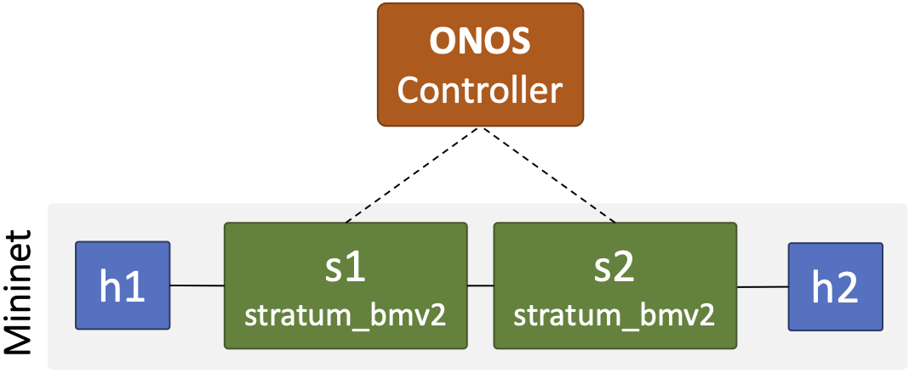

# Assignment 1: File and Message Transmission using Sockets and 3-Way Handshake

In this assignment, we will be building a file-/message-transmission client-server application using Sockets and a low-level implementation of TCP's 3-way handshake protocol (3WH).

> **NOTE:** You may work in a team of **TWO** if you would like (this is strongly suggested but not required; grading will only be based on your submission regardless of the size of the team).

Sockets are the standard way to write programs that communicate over a network. While originally developed for Unix computers programmed in C, the socket abstraction is general and not tied to any specific operating system or programming language. This allows programmers to use the socket mental model to write correct network programs in many contexts.

This part of the assignment will give you experience with basic socket programming. You will write a pair of TCP client and server programs for sending and receiving text messages over a virtual network (see figure below). You will also implement a low-level 3WH client using [Scapy](). The client/server pair is written in C, while the 3WH client is written in Python.

The client and server programs should meet the following specifications. Be sure to read these meticulously before and after programming to make sure your implementation fulfills them:

### Server specification
- Each server program should listen on a socket, wait for a client to connect, receive a message from the client, print the message to stdout, and then wait for the next client indefinitely.
- Each server should take one command-line argument: the port number to listen on for client connections.
- Each server should accept and process client communications in an infinite loop, allowing multiple clients to send messages to the same server. The server should only exit in response to an external signal (e.g., `SIGINT` from pressing `ctrl-c`).
- Each server should maintain a short (5-10) client queue and handle multiple client connection attempts sequentially. In real applications, a TCP server would fork a new process to handle each client connection concurrently, but that is not necessary for this assignment.
- Each server should gracefully handle error values potentially returned by socket programming library functions (see specifics for each language below). Errors related to handling client connections should not cause the server to exit after handling the error; all others should.

### Client specification (both Sockets and 3WH)
- Each client program should contact a server, read a message from stdin, send the message, and exit.
- Each client should read and send the message exactly as it appears in `stdin` until reaching an `EOF` (end-of-file).
Each client should take two command-line arguments: the server's IP address and the port number of the server.
- Each client must be able to handle arbitrarily large messages by iteratively reading and sending chunks of the message, rather than reading the whole message into memory first.
- Each client should handle partial sends (when a socket only transmits part of the data given in the last send call) by attempting to re-send the rest of the data until it has all been sent.
- Each client should gracefully handle error values potentially returned by socket programming library functions.

## Getting Started

### Virtual environment and network topology
This assignment builds on [assignment0](../assignment0), so please ensure that you have a successfully working virtual environment. We will be building a slightly different network this time, as depicted in the following figure.



- We have updated the `Makefile` to make it easier to run and test your assignment. You can type make help from the top directory to list an example usage of the necessary commands.

- Install Mininet prerequisites and dependencies. (Make sure Mininet is running in another terminal before executing this command).
  ```sh
  $ cd assignments/assignment1
  $ make mininet-prereqs
  ```

### Client-server code

We have provided scaffolding code in the `assignments/assignment1/` directory.
*You should read and understand this code before starting to program.*

You should program only in the locations of the provided files marked with `TODO` comments. There is one `TODO` section per client and one per server. You can add functions if you wish, but do not change file names, as they will be used for automated testing.

The following sections provide details for the client and server programs in each language.

#### - C
The classic "Beej's Guide to Network Programming" is located here: [https://beej.us/guide/bgnet/html/](https://beej.us/guide/bgnet/html/).
The [system call section](https://beej.us/guide/bgnet/html/#system-calls-or-bust) and [client/server section](https://beej.us/guide/bgnet/html/#client-server-background) will be most relevant. The man pages are also useful for looking up individual functions (e.g., `man socket`).

The files `client.c` and `server.c` contain scaffolding code. You will need to add socket programming and I/O code in the `TODO` locations. The reference solutions have roughly 70 (well commented and spaced) lines of code in the `TODO` sections of each file. Your implementations may be shorter or longer.

For error handling, you can call `perror` for socket programming functions that set the global variable `errno` (Beej's Guide will tell you which do). For those that don't, simply print a message to standard error.

You should build your solution by running `make` in the `assignments/assignment1` directory. Your code *must* build using the provided `Makefile`. The server should be run as `./srcs/server (port) > (output file)`. The client should be run as `./srcs/client (server IP) (server port) < (message file)`. See [Testing](#testing) section for more details.

#### - 3WH
For 3WH, you will use [Scapy](https://scapy.net/) to implement a Python class with low-level APIs for establising and closing connections as well as sending data over TCP. You can read more about the TCP protocol [here](https://book.systemsapproach.org/e2e/tcp.html#). For this assignment, you will implement a [stop-and-wait](https://book.systemsapproach.org/direct/reliable.html#stop-and-wait) relibale delivery mechanism for TCP (no sliding window).

The file `client-3wh.py` contains the scaffolding code. You will need to add 3WH programming code in the locations marked `TODO`. The reference solutions have roughly 50 (well commented and spaced) lines of code in the `TODO` sections of the source file. Your implementations may be shorter or longer.

You will run the existing C server as `./server (port) > (output file)`. The client should be run as `./client-3wh.py (server IP) (server port) < (message file)`.

### Testing

You can test your implementations by attempting to send messages from your clients to your servers in the virtual environment. Either `h1` or `h2` can act as a server or client. For the server, use a high port number, between 10000 and 60000. Then, from your client, connect to the server using its host's IP address and the port number. You can kill the server by pressing `ctrl-c`.

> **Note:** You can log into the hosts using the `make host name=<hostname>` command (e.g., `make host name=h1`). 

The provided tests under `Tests.mak` will test your implementation by attempting to send several different messages between different combinations of your clients and servers (C client to C server and 3WH client to C server). The messages are the following:

1. The short message "Go Boilermakers!\n"
2. A long, randomly generated alphanumeric message
3. A long, randomly generated binary message
4. Several short messages sent sequentially from separate clients to one server

You can run the tests as follow ...

```sh
$ cd assignments/assignment1
$ make tests
```

> **Note:** We run this command from the VM; not the Mininet hosts (e.g., h1 or h2). The command will automatically log into the Mininet hosts and start the client/server processes. 

For each client/server pair, the test script will print "PASSED!" if the message is sent and received correctly; and "FAILED!", otherwise.

> ---
> ### Debugging hints
>
> Here are some debugging tips. If you are still having trouble, ask a question on [Campuswire](https://www.gradescope.com/courses/227978) or see an instructor during office hours.
>
> * There are defined buffer size and queue length constants in the scaffolding code. Use them. If they are not defined in a particular file, you don't need them. If you are not using one of them, either you have hard-coded a value, which is bad style, or you are very likely doing something wrong.
> * There are multiple ways to read and write from `stdin`/`stdout` in C and Python. Any method is acceptable as long as it does not read an unbounded amount into memory at once and does not modify the message.
> * If you are using buffered I/O to write to stdout, make sure to call `flush` or the end of a long message may not write.
> * Remember to close the socket at the end of the client program.
> * If you get "address already in use" errors, make sure you don't already have a server running. Otherwise, restart your virtual environment as described in [assignment0](../assignment0).  
> * If you are getting other connection errors, try a different port between 10000 and 60000.

> ### Q&A
>
> * **Should I set the `MSG_WAITALL` flag on `recv()`?** No. This causes `recv()` to not return until it receives a specified amount of data. However, the server cannot know this amount in advance, so you should instead keep calling `recv()` until there is nothing left to receive.
> * **Do I need to handle signals such as SIGINT to clean up the server process when the user presses `ctrl-c`?** No, it is not necessary for this assignment. The default response to signals is good enough. Keep in mind it would be good practice to do so in general.
> * **Should I use stream or datagram sockets?** Please use stream sockets to ensure that the exact message is delivered. Datagram packets are not guaranteed to be delivered.
> * **Should the client wait to receive a reply from the server?** No, in this assignment, it should exit immediately after sending all the data.
> * **Should the server handle client connections concurrently (in separate processes)?** No, as stated in the client specification, this is not required in this assignment. So no need to use `fork()`!
> * **Where can I learn more about Scapy?** The following interactive tutorial will provide you with the necessary basics needed to complete the assignment - https://scapy.readthedocs.io/en/latest/usage.html#interactive-tutorial.
> ---

## Submission and Grading
Submit the assignment by uploading your modified client and server files to [Brightspace](https://purdue.brightspace.com/d2l/le/content/599158/viewContent/10629344/View).
You can submit as many times as you like before the deadline, but we will only take the last submission.

We will grade your assignments by running the tests under `Tests.mak` and additional tests with large messages, multiple simultaneous clients, etc. Double-check the specifications above and perform your own tests before submitting them.

Code that does not compile is graded harshly; if you want partial credit on code that doesn't compile, comment it out and make sure your file compiles!

Remember that, in addition to your C client/server pair, you should submit another client-3wh.py file!

## Acknowledgement

This assignment is partially modeled after a [similar assignment](https://github.com/PrincetonUniversity/COS461-Public/tree/master/assignments/assignment1) offered at Princeton University by my Ph.D. advisor, Nick Feamster.
